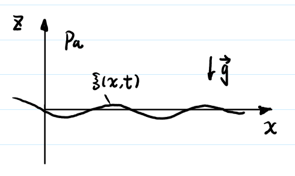
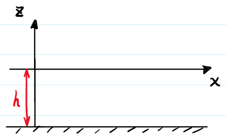

# 流体之美——趣味小知识系列（一）


如何通过波浪行进速度快速估计出湖的深度？生活小妙招 Get！




如下图所示，简化湖面为二维情形，建立平面直角坐标系 $ (z, \,x) $。



对于湖水，考虑 **无粘、不可压、原始静止、小扰动** 情况下的 ***Navier-Stokes (N-S)* 方程**，即 ***Euler* 方程**
$$
\frac{\partial \vec{u}}{\partial t} + \left(\vec{u} \cdot \nabla\right) \vec{u} = - \frac{1}{\rho} \nabla p + \vec{g}
$$


其中，$ \vec{u} $ 为速度，$ \rho $ 为密度，$ p $ 为压强，$ \vec{g} $ 为重力加速度矢量。



由原始静止、小扰动条件，可假设扰动速度与压强为
$$
\vec{u} = \vec{u}_{0} + \vec{u}^{\prime} = \vec{u}^{\prime} , \quad p = p_{0} + p^{\prime}
$$


其中，满足 $ \vec{u} $ 为趋于零的小量，且 $ p^{\prime} \ll p_{0} $。



将式 (2) 代入式 (1) ，忽略高阶小对流项 $ \left(\vec{u} \cdot \nabla\right) \vec{u} $ ，得到 **线性化 *Euler* 方程**
$$
\frac{\partial \vec{u}^{\prime}}{\partial t} = - \frac{1}{\rho} \nabla p + \vec{g}
$$
 

首先对上式两边取旋度，由于重力有势，故有
$$
\frac{\partial \vec{\omega}^{\prime}}{\partial t} \equiv 0
$$
其中 $ \vec{\omega}^{\prime} = \nabla \times \vec{u}^{\prime} $ 为扰动速度旋度，故扰动速度无旋。

由无旋场与有势场的等价性，可引入扰动速度势 $ \varphi $，满足
$$
 \vec{u}^{\prime} = \nabla \varphi 
$$
 将上式代入不可压连续性方程 $ \nabla \cdot \vec{u}^{\prime} = 0 $，可得
$$
\nabla^{2} \varphi = \Delta \varphi = \frac{\partial^{2} \varphi}{\partial z^{2}} + \frac{\partial^{2} \varphi}{\partial x^{2}} = 0
$$


即扰动速度势满足 ***Laplace* 方程**。又将式 (5) 代入式 (3) 左式，可得
$$
\frac{\partial}{\partial t} \nabla \varphi = - \nabla \left(\frac{p}{\rho} + g z\right)
$$
 

其中，$ z $ 为水深。另外，由流体静力学知识，有
$$
p = p_{a} - \rho g z + p^{\prime}
$$
其中，$ p_{a} $ 为湖面上方大气压强，假设保持恒定。将式 (8) 代入式 (7)，可得
$$
\frac{\partial}{\partial t} \nabla \varphi = - \nabla \left(\frac{p}{\rho} + g z\right) = - \nabla \left(\frac{p_{a} + p^{\prime}}{\rho}\right) = - \nabla \left(\frac{p^{\prime}}{\rho}\right)
$$
上式可进一步化为
$$
\frac{\partial \varphi}{\partial t} = - \frac{p^{\prime}}{\rho}
$$
假设水波自由面方程为 $ z = \zeta \left(x, t\right) $，$ \zeta $ 为偏离平衡位置的位移小量，在该界面上满足 $ p = p_{a} $，代入式 (8) 可得
$$
p^{\prime} = \rho g \zeta
$$


将式 (11) 代入式 (10) 可得水波的 **动力学边界条件**
$$
\left.\frac{\partial \varphi}{\partial t}\right|_{z=\zeta}=-g \zeta
$$
考虑水波自由面作为物质面的运动过程
$$
V_{z} = \left.\frac{\partial \varphi}{\partial z}\right|_{z=\zeta}=\frac{\mathrm{d} \zeta}{\mathrm{d} t} = \frac{\partial \zeta}{\partial t}+\frac{\partial \zeta}{\partial x} \frac{\mathrm{d} x}{\mathrm{d} t} = \frac{\partial \zeta}{\partial t}+\frac{\partial \zeta}{\partial x} u^{\prime}
$$
对上式略去高阶小量，进行线性化，得到水波的 **运动学边界条件**
$$
\left.\frac{\partial \varphi}{\partial z}\right|_{z=\zeta}=\frac{\partial \zeta}{\partial t}
$$
结合式 (12) 与 (14)，可得
$$
\left.\left(\frac{\partial^{2} \varphi}{\partial t^{2}}+g \frac{\partial \varphi}{\partial z}\right)\right|_{z = \zeta} = 0
$$
下面应用两个边界条件，再通过引入壁面边界条件，求解扰动速度势满足的 ***Laplace* 方程**。

引入波长为 $ \lambda $，周期为 $ T $，波数为 $ k = \frac{2 \pi}{\lambda} $，频率为 $ \omega = \frac{2 \pi}{T} $，波速为 $ c = \frac{\omega}{k} = \frac{\lambda}{T} $ 的**主模态 (Normal mode)**
$$
\varphi=\Phi(z) e^{i(k x-\omega t)}
$$
其满足 ***Laplace* 方程** (6) 的通解为
$$
\Phi(z)=\phi_{1} e^{k z}+\phi_{2} e^{-k z}
$$


其中，$ \phi_{1}, \, \phi_{2} $ 为常数。



- 考虑**有限水深**情况，水深 $ h $。

如图，考虑水底无穿透边界条件为
$$
\left.\frac{\partial \varphi}{\partial z}\right|_{z = - h} = 0
$$
将式 (16) (17) 代入上式，可令
$$
\phi_{1} e^{-k h}=\phi_{2} e^{k h}=\frac{1}{2} \phi_{0}
$$
进一步可得
$$
\Phi(z)=\phi_{0} \cosh \left[k(z+h)\right]
$$


故扰动速度势 $ \varphi $ 解为


$$
\varphi=\phi_{0} \cosh \left[k(z+h)\right] e^{i(k x-\omega t)}
$$
将上式解代入式 (15)，可得水波色散关系式
$$
\omega^{2} = gk \tanh (kh)
$$


注意到，当 $ kh \ll 1 $，即 $ h \ll \frac{1}{k} = \frac{\lambda}{2 \pi} $ 时，有


$$
\tanh (kh) = kh - \frac{1}{3} (kh)^{3} + O((kh)^{5}) \approx kh
$$
将上式代入式 (22)，可得
$$
\omega^{2} = gk \left[kh - \frac{1}{3} (kh)^{3} + O((kh)^{5})\right] = g h k^{2} \left[1 - \frac{1}{3} (k h)^{2} + O ((kh)^{4})\right]
$$
故水波波速 $ c $ 为
$$
c = \frac{\omega}{k} = \frac{\lambda}{T} = \sqrt{g h \left[1 - \frac{1}{3} (k h)^{2} + O ((kh)^{4})\right]} \approx \sqrt{g h}
$$
观察上式可得，若**水深 $ h $ 远小于波长 $ \lambda $** 时，此时称该界面波为**浅水波**，具有**非色散**特性，特征是波速 $c$ 仅与以及水深 $ h $ 有关。

有了上面的波速关系式，我们就可以回到最初的问题，即**如何仅通过观察波浪行进速度就能估计出湖的深度？**

*若我们观察到一列行进速度较为稳定的大波浪，其**波长   $ \lambda $ ** 很长，可近似满足远大于**水深 $ h $** 的条件，即可快速估计水深*
$$
h = \frac{c^{2}}{g}
$$
*其中，$ c $ 为水波行进速度， $ g \approx 9.81 \, \text{m} / \text{s}^{2} $  为重力加速度。*

事实上，该关系式在 $ \frac{\lambda}{20} < h < \frac{\lambda}{2} $ 情况下均适用。



^_^ This is the END of the article. Thank you for reading! 

If you think this article is helpful to you, do not hesitate to leave your comments!

Finished by <i><b>pkufzh (Small Shrimp)</b></i> on <i><b>2022/02/07</b></i> .



<i> Who am I? A happy shrimp from Peking University! </i>

