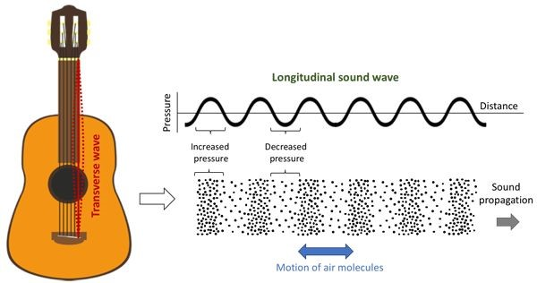
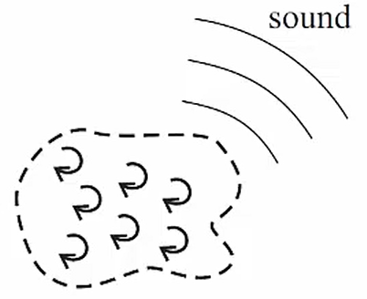
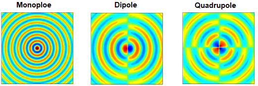

# 有趣的流体小知识（三）——Lighthill声学比拟



*「这篇论文是一项杰作，充分利用数学工具对其观点进行了优美的阐述，所有分析都建立在最基础的层次上，他推导出的产生声音的精确理论，完全秉承了几百年来声学大师的传统理念。如果 Rayleigh 或者 Stokes 当时就意识到这个问题的重要性，同样会推导出这些结果。气动声学从此翻开了崭新的一页……」*

***「自古英雄出少年」**，Lighthill 在尝试解释射流噪声问题时，并没有运用非常复杂的数学工具或理论，而是结合流体方程，**对流动发声的物理源头**进行数学建模与比拟分析，从而找到了**声场与流场之间的相似关联**，并最终给出**简洁的数学表达形式**。*



## 如何解释气流噪声——传统声学的困境

声音传播是自然界中最常见的一种物理现象。风吹过电线会发出奇特的鸣叫，气流吹过竹笛会产生美妙的旋律。从音乐到噪声，从次声波到超声波，从说话鼓掌到喷气式发动机轰鸣……声音传播与我们的生活息息相关。

声学，作为一门古老的学科，其已经有数百年的发展历史。**经典声学**认为，声音在气体中的传播是基于分子的运动，是由分子碰撞引起的。振动发出的声波在空间内传播，距离声源较近的介质分子首先感受到声波产生的微小的压强与密度的变化，进而通过分子碰撞将这种影响传递给相邻的分子，如图 [1](#fig1) 所示。通过这一种类似「多米诺骨牌」式的连锁反应，声波由近及远传播，并随着距离与时间的增大而不断衰减。声波传播实质上是对扰动的一种输运。

 图 1  声波与声音传播示意图 

 

在20世纪50年代之前，人们对声音产生的机理仍然停留在传统声学的范畴。第二次世界大战之后，航空工业在欧美等工业强国得到迅速发展，喷气式发动机的出现，使得人类突破音障成为可能。然而，**严重的气流噪声制约着喷气式发动机的商业化应用，解决流动噪声问题成为难题**。当时的工程师或研究人员仍倾向将这类发动机噪声、射流噪声、螺旋桨噪声等流动发声现象理解为流体冲击壁面振动发声。但在50年代，*Lilley* 用将铅笔放进射流中扰动流场来改变噪声模态的实验否定了这种说法。**人们逐渐意识到，过去几百年的经典声学理论与认识尚无法解决具有实际工程意义的流动发声问题，亟待新的理论与学科出现。**

## 伟大的妙想——Lighthill的声学比拟

1949年的英国，在一趟从曼彻斯特到伦敦的列车上，一位时年25岁的年轻人在信封背面推导公式，相应思想与结果经三年几易其稿，以*《**On sound generated aerodynamically I. General theory**》*为题，在英国皇家学会会刊（*Proceedings of the Royal Society of London*）上正式发表。后来为「协和号」（Concorde）超声速客机的研制做出突出贡献的 *John Ffowcs Williams* 教授曾这样评价这项工作：

> *「这篇论文是一项杰作，充分利用数学工具对其观点进行了优美的阐述，所有分析都建立在最基础的层次上，他推导出的产生声音的精确理论，完全秉承了几百年来声学大师的传统理念。如果 Rayleigh 或者 Stokes 当时就意识到这个问题的重要性，同样会推导出这些结果。**气动声学**从此翻开了崭新的一页……」*

**「自古英雄出少年」**，这位年轻人就是气动声学领域的奠基人与先驱者，英国著名的应用数学家，**詹姆斯·莱特希尔**（*James Lighthill*, 1924 ~ 1998），这项工作的核心便是提出了 **声学比拟** 这一重要概念，**是对传统声学的一次开拓性的贡献，并标志着气动声学这一交叉学科的诞生，成为一座连接流体力学与声学的桥梁。**

*Lighthill* 的比拟核心思想在于，将有旋的流动区域（如图 [2](#fig2) 所示）类比为一个四极子声源，从而将由流动引起的声波传播问题，等效为经典的有源声学问题。这种思想充分继承了声波传播的传统理念，并对流动发声的物理现象给出合理的解释，是对声音产生机理的丰富与拓展，具有深刻的物理内涵。

 图 2  由有旋流动引起的声波传播示意图 

 

## 优美的阐述——应用数学与物理内涵

在对科学问题与物理现象具有深刻理解后，应用数学的下一个重要步骤便是建立严谨的数学模型来描述现象。而 *Lighthill* 正是采用这样的思想[[1]](#refer-anchor-1)[[2]](#refer-anchor-2)，从最基本的流动运动 ***Navier-Stokes（N-S）***方程出发，推导声学比拟方程，得到流体发声现象的数学阐述。下面对这一过程涉及的应用数学方法与物理内涵进行说明。

考虑无界区域内由局部有旋流动区域所引起的扰动传播问题。在无穷远处流体处于静止状态，相应的流体压强、密度和声速分别记为                          $p_{0} \, , \rho_{0} \,$ 和 $c_{0}$。忽略体积力，写出流体运动的基本控制方程为
$$
\frac{\partial\rho}{\partial t}+\frac{\partial\left(\rho u_i\right)}{\partial x_i}=0
\tag{1}
\label{1}
$$

$$
\frac{\partial\left(\rho u_i\right)}{\partial t}+\frac{\partial\left(\rho u_iu_j\right)}{\partial x_i}=-\frac{\partial p}{\partial x_i}+\frac{\partial\tau_{ij}}{\partial x_j}
\tag{2}
\label{2}
$$

其中，$p, \,\rho$ 和 $u_{i}\,(i = 1,2,3)$ 分别代表气体压强、密度和速度。$\tau_{ij}$ 为黏性应力项（忽略雷诺应力），其形式为
$$
\tau_{ij}=2\mu S_{ij}-\frac{2}{3}\delta_{ij}\nabla\cdot\mathbf{u}=\mu\left(\frac{\partial u_i}{\partial x_j}+\frac{\partial u_j}{\partial x_i}-\frac{2}{3}\delta_{ij}\frac{\partial u_k}{\partial x_k}\right)
\tag{3}
\label{3}
$$
则动量方程可进一步写成
$$
\frac{\partial\left(\rho u_i\right)}{\partial t}=-\frac{\partial\pi_{ij}}{\partial x_j}
\tag{4}
\label{4}
$$
其中定义动量通量张量为
$$
\pi_{ij}=\rho u_iu_j+\left(p-p_0\right)\delta_{ij}-\tau_{ij}
\tag{5}
\label{5}
$$
在经典声学理论中（理想可压缩流体中线性小扰动引起的流动），$\pi_{ij}$ 可以退化为
$$
\pi_{ij}^0=\left(p-p_0\right)\delta_{ij}=c_0^2\left(\rho-\rho_0\right)\delta_{ij}
\tag{6}
\label{6}
$$
利用上式，动量方程可化为
$$
\frac{\partial\left(\rho u_i\right)}{\partial t}+\frac{\partial}{\partial x_i}\left[c_0^2\left(\rho-\rho_0\right)\right]=0
\tag{7}
\label{7}
$$
在连续方程中引入 $\rho_{0}$ ，可以得到
$$
\frac{\partial}{\partial t}\left(\rho-\rho_0\right)+\frac{\partial\left(\rho u_i\right)}{\partial x_i}=0
\tag{8}
\label{8}
$$
由以上两式联立，可消去 $\rho u_{i}$ 项，即得
$$
\left(\frac{1}{c_0^2}\frac{\partial^2}{\partial t^2}-\nabla^2\right)\left[c_0^2\left(\rho-\rho_0\right)\right]=0
\tag{9}
\label{9}
$$
上式即为经典声学的**无源齐次双曲波动方程**，是传统声学理论的奠基性方程，注意引入了理想无黏和线性化假设。***Lighthill* 的过人之处在于，利用比拟思想，考虑不对动量通量张量进行简化，即舍去理想化假设，来刻画控制流动的物理项对经典声学波动方程的影响。**对于一般黏性流动，**引入 *Lighthill* 张量**
$$
T_{ij}=\pi_{ij}-\pi_{ij}^0=\rho u_iu_j+\left[\left(p-p_0\right)-c_0^2\left(\rho-\rho_0\right)\right]\delta_{ij}-\tau_{ij}
\tag{10}
\label{10}
$$
则动量方程可化为
$$
\frac{\partial\left(\rho u_i\right)}{\partial t}+\frac{\partial\pi_{ij}^0}{\partial x_j}=-\frac{\partial T_{ij}}{\partial x_j}
\tag{11}
\label{11}
$$
类似地，将动量通量张量代入可得
$$
\frac{\partial\left(\rho u_i\right)}{\partial t}+\frac{\partial}{\partial x_j}\left[c_0^2\left(\rho-\rho_0\right)\right]=-\frac{\partial T_{ij}}{\partial x_j}
\tag{12}
\label{12}
$$
最终消去 $\rho u_{i}$ 项，可以得到
$$
\left(\frac{1}{c_0^2}\frac{\partial^2}{\partial t^2}-\nabla^2\right)\left[c_0^2\left(\rho-\rho_0\right)\right]=\frac{\partial^2T_{ij}}{\partial x_i\partial x_j}
\tag{13}
\label{13}
$$
这就是著名的 ***Lighthill* 方程**，也是**气动声学领域的奠基性方程**。由上述推导可以看出，*Lighthill* 方程由流体控制 *N-S* 方程直接推出，没有添加任何其他假设或者参量，是一个「精确」的方程。同时，对比 *Lighthill* 方程与经典声学双曲波动方程，两者仅在右端源项存在差异，其中流动发声声源为由 *Lighthill* 张量的空间二阶梯度组成的四极子声源。整个推导过程中，数学演算严谨、干净、优美，物理内涵清晰易懂，依赖概念虽异常基础，获得结论却十分震撼。

作为一名流体力学研究者，*Lighthill* 对流体性质首先拥有敏锐的直觉与认知，但他又不仅仅局限于流体领域的探索，而是大胆迈出去，汲取传统声学的理论精华，充分发挥类比与想象，寻找运动流体与发声声源这本不相关的二者内在的相似性，并运用数学工具，成功建立精准简洁的数学描述。这种由学科交叉促生的比拟思想，不仅拥有非凡的理论与实际应用价值，更具有拓展与延伸的生命力。

历史上，*Lighthill* 声学比拟理论经由 *Curle* 的推广[[3]](#refer-anchor-3)用于解释固壁发声问题。一般形式的声学比拟方程（***Ffowcs Williams and Hawkings equation, FW-H***[[4]](#refer-anchor-4)）在物理上清晰解释了运动物体的三个气动声源（如图 [3](#fig3) 所示）：厚度噪声（单极子噪声）、载荷噪声（偶极子噪声）以及湍流噪声（四极子噪声），推动了气动声学学科的深入发展。

 图 3  气动声源的三种类型示意图 

 

## 有趣的故事——Lighthill的著名预测

**有趣的是，**正是这样一位应用数学大师与交叉学科的先行者，*Lighthill* 在1973年提交给英国科学与工程研究委员会的名为《*Artificial Intelligence: A General Survey*》的一篇评论中，对当时尚在襁褓的人工智能（Artificial Intelligence, AI），表达了对这一领域许多核心研究方面的非常悲观的预测，称**「该领域迄今为止的发现尚未产生当时承诺的重大影响」**（*「In no part of the field have the discoveries made so far produced the major impact that was then promised」*），并直接导致当时英国政府对大学的人工智能研究停止拨款。而在21世纪的今天，人工智能技术作为前沿交叉学科的代表，其各个研究方向已经成为炙手可热。*Lighthill* 的预测似乎是错误的，这不禁引发我们思考，应如何看待应用数学与学科交叉的未来？

**传奇已经谢幕，但 *Lighthill* 的故事依旧启发我们思考：当新的事物、新的机遇出现时，应该固守成规，还是开拓进取？**

------

以上就是本文全部内容，如有疑问，敬请大家批评指正！

相应文章也将发布在我的 [B站空间](https://www.bilibili.com/read/cv15262815) 、[知乎专栏](https://zhuanlan.zhihu.com/p/468074536) 上。后续我会不定期更新本博客与专栏，欢迎大家关注！ 

------

## 参考文献

- [1] Lighthill, M. J. (1952). On sound generated aerodynamically I. General theory. *Proceedings of the Royal Society of London. Series A. Mathematical and Physical Sciences*, 211(1107), 564-587.

- [2] Lighthill, M. J. (1954). On sound generated aerodynamically II. Turbulence as a source of sound. *Proceedings of the Royal Society of London. Series A. Mathematical and Physical Sciences*, 222(1148), 1-32.

- [3] Curle, N. (1955). The influence of solid boundaries upon aerodynamic sound. *Proceedings of the Royal Society of London. Series A. Mathematical and Physical Sciences*, 231(1187), 505-514.

- [4] Williams, J. F., & Hawkings, D. L. (1969). Sound generation by turbulence and surfaces in arbitrary motion. *Philosophical Transactions for the Royal Society of London. Series A, Mathematical and Physical Sciences*, 321-342.

------



^_^ This is the END of the article. Thank you for reading! 

If you think this article is helpful to you, do not hesitate to leave your comments!

Finished by <i><b>pkufzh (Small Shrimp)</b></i> on <i><b>2022/02/19</b></i> .



<i> Who am I? A happy shrimp from Peking University! </i>

