# 有趣的流体小知识（二）——神奇的卡门涡街



***天才通常拥有比常人敏锐的洞察力。**实验中的这种反常现象**引起了冯·卡门的注意**，他想「也许振动不是偶然的，而是由内在原因决定的」。于是卡门从理论上进行思考，起初他设想圆柱体后的水流形成两道对称排列但反方向的旋涡，但发现这种状态不能维持，很快不稳定。于是他<font color = red>**假设两道旋涡交错排列**</font>，计算结果表明这种状态在一定条件下能够维持。卡门将计算结果向导师普朗特报告。随即普朗特命卡门写出论文发表。这是卡门的第一篇论文，也是他的**成名之作**。这个关于涡街的理论被后来众多实验证实。**「卡门涡街」的名称，也沿用至今**。*



## 历史注记

<p align="left"><i> <b>摘自 Wikipedia</b> <a href="https://en.wikipedia.org/wiki/K%C3%A1rm%C3%A1n_vortex_street" style="text-decoration: none">"Kármán vortex street" </a></i></p>

### 什么是卡门涡街

> *In fluid dynamics, a **Kármán vortex street** (or a **von Kármán vortex street**) is a repeating pattern of swirling vortices, caused by a process known as vortex shedding, which is responsible for the unsteady separation of flow of a fluid  around blunt bodies.*

在流体动力学中，**卡门涡街** (或 **冯·卡门涡街**)是一种重复的旋涡模式，由一个被称作旋涡脱落的过程引起，该过程是钝体周围的流体流动产生非定常分离的原因之一。

> *It is named after the engineer and fluid dynamicist **Theodore von Kármán** and is responsible for such phenomena as the "singing" of suspended telephone or power lines and the vibration of a car antenna at certain speeds. Mathematical modeling of von Kármán vortex street can be performed using different techniques including but not limited to solving the full Navier-Stokes equations with k-epsilon, SST, k-omega and Reynolds stress, and large eddy simulation (LES) turbulence models, or by numerically solving some dynamic equations such as the Ginzburg-Landau equation.*

它以工程师兼流体动力学家 **西奥多·冯·卡门** 的名字命名。悬挂在空中的电话或电力线会发出「嗡鸣」，汽车天线在特定风速下会振动，这些现象都是由卡门涡街造成的。卡门涡街有多种数学建模方式，比如求解应用 *k-epsilon*, *SST*, *k-omega*, 雷诺应力和大涡模拟 (*LES*) 湍流模型的完整 *Navier-Stokes* 方程，或数值求解 *Ginzburg-Landau* 方程等动力学方程。

### 卡门涡街的发现

> Although named after Theodore von Kármán, he acknowledged that the vortex street had been studied earlier by Arnulph Mallock and Henri Bénard. Kármán tells the story in his book Aerodynamics: 

虽然以冯·卡门的名字命名，卡门本人指出 **阿努夫·马洛克** 和 **亨利·伯纳德** 早前就对漩涡街进行过研究。卡门在他的《*Aerodynamics*》（空气动力学）著作中讲述了这样一个有趣的故事：

> *...Prandtl had a doctoral candidate, Karl Hiemenz, to whom he gave the task of constructing a water channel in which he could observe the separation of the flow behind a cylinder. The object was to check experimentally the separation point calculated by means of the boundary-layer theory. For this purpose, it was first necessary to know the pressure distribution around the cylinder in a steady flow. Much to his surprise, Hiemenz found that the flow in his channel oscillated violently. When he reported this to Prandtl, the latter told him: 'Obviously your cylinder is not circular.' However, even after very careful machining of the cylinder, the flow continued to oscillate. Then Hiemenz was told that possibly the channel was not symmetric, and he started to adjust it. I was not concerned with this problem, but every morning when I came in the laboratory I asked him, 'Herr Hiemenz, is the flow steady now?' He answered very sadly, 'It always oscillates.'*

1911年，**路德维希·普朗特**[<sup>1</sup>](#note-anchor-1) 给了他的一个博士生，**卡尔·希门兹**[<sup>2</sup>](#note-anchor-2)  一个任务：建造一个可以观察到圆柱体后面的水流分离的水道，以通过实验来检验利用边界层理论计算出的流动分离点的正确性。为此，首先需要知道在稳定流动中圆柱体周围的压力分布。令希门兹吃惊的是，他发现管道中的流动振荡十分剧烈。当他将这一情况报告给普朗特时，导师告诉他：「很明显，你的圆柱体不是准确的圆形。」然而，即使在对圆柱进行了非常仔细的打磨之后，流动仍然在振荡。接着，普朗特又告诉希门兹可能由于槽道不对称，希门兹又开始调整它。我不是很关心这个问题，但每天早上我一进实验室就问他：「希门兹先生，现在流量稳定了吗?」他非常悲伤地回答说:「它总是振荡的。」

<div id="note-anchor-1"></div>

- 注 1：近代力学奠基人之一，被誉为空气动力学之父和现代流体力学之父，冯·卡门的恩师。

<div id="note-anchor-2"></div>

- 注 2 ：普朗特与卡门的学生，驻点流（Plane stagnation point flow）提出与最早研究者。

**天才通常拥有比常人敏锐的洞察力。**实验中的这种反常现象**立刻引起了冯·卡门的注意**，他想「也许振动不是偶然的，而是由内在原因决定的」。于是卡门从理论上进行思考，起初他设想圆柱体后的水流形成两道对称排列但反方向的旋涡，但发现这种状态不能维持，很快不稳定。于是他<font color = red>**假设两道旋涡交错排列**</font>，计算结果表明这种状态在一定条件下能够维持。卡门将计算结果向导师普朗特报告。随即普朗特命卡门写出论文发表。这是卡门的第一篇论文，也是他的成名之作。这个关于涡街的理论被后来众多实验证实。**「卡门涡街」的名称，也沿用至今**。

谦虚的卡门认为他在1911~1912年，对这一问题研究的贡献主要在两个方面：

- 一是发现涡街只有当涡旋是反对称排列，且仅当行列的距离对同行列内相邻两涡旋的间隔有一定的比值时才稳定；
- 二是将涡系所携带的动量与阻力联系了起来。

不过，这一开创性贡献足以写进后辈们的教科书了~

下面，就让我们回到1911年，感悟大师的直觉，享受物理的奇妙，体验科学的魅力。

## 卡门的建模思路

物理的直觉告诉卡门，流动稳定的振荡与组合旋涡，即点涡系的稳定性有关。但是，两道对称排列但反方向的旋涡的互相诱导明显不稳定。那么如果两道旋涡交错排列呢？这样又能诞生怎样的流体之美呢？

现在构建一个按图 [1](#fig1) 所示排列的点涡系，其由两排强度相同、符号相反，水平间距相同 (均为 $a$)，错位排列的点涡列组成，考虑无粘情形。两排点涡位于 $y = \pm \frac{b}{2}$ 直线上。

<span id = "fig1"></span>

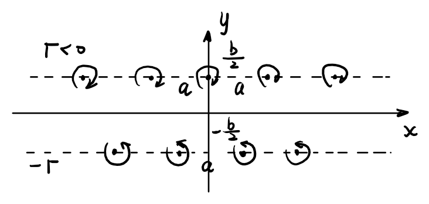

<center><font size = 2.5> 图 1  双列交错点涡系示意图 </font></center>

<br/>

试解答以下问题：

1. 求 $z = \frac{a}{2} - \mathrm{i} \frac{b}{2}$ 处的点涡 $\alpha$ 速度；
2. 绘制点涡系诱导流场的流线。并思考：**当两列点涡满足什么位置关系时，点涡系能够保持无粘中性稳定**？

## 模型的数学解答

我们知道，在复平面上，考虑二维、不可压、势流情形，点涡诱导速度的复位势可以表达为[<sup>[1]</sup>](#refer-anchor-1)
$$
W(z) = \frac{\Gamma}{2 \pi \mathrm{i}} \ln(z - z_{0})
\tag{1}
\label{eq1}
$$
其中，$z=x + \mathrm{i} y = re^{i \theta}$ 为复平面坐标，$z_{0}$ 为点涡位置。复位势可表达为
$$
W(z) = \phi + \mathrm{i} \psi
\tag{2}
\label{eq2}
$$
其中，$\phi$ 为速度势，$\psi$ 为流函数。

如图 [2](#fig2) 所示，考虑放置在 $x$ 轴上，关于 $y$ 轴对称（原点布置一个点涡），强度相同，间距相同为 $a$ 的一排无穷多个点涡。

<span id = "fig2"></span>

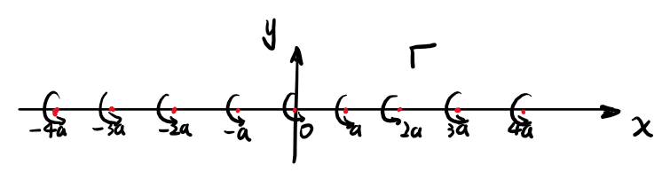

<center><font size = 2.5> 图 2  单列点涡系示意图 </font></center>

<br/>

由叠加原理，其复位势可表示为[<sup>[2]</sup>](#refer-anchor-2)
$$
W(z)=\frac{\Gamma}{2 \pi i} \sum_{n = -\infty}^{\infty} \ln (z-n a)=\frac{\Gamma}{2 \pi i} \ln \left[\frac{\pi z}{a} \prod_{n=1}^{\infty}\left(1-\frac{z^{2}}{n^{2} a^{2}}\right)\right]+\left(\frac{\Gamma}{2 \pi i} \ln \left[\frac{a}{\pi}\left(-a^{2} )(-4 a^{2}\right) \cdots\left(-n^{2} a^{2}\right)\right]\right)
\tag{3}
\label{eq3}
$$
由正弦三角函数展开式
$$
\sin x = x \prod_{n=1}^{\infty}\left(1-\frac{x^{2}}{n^{2} \pi^{2}}\right)
\tag{4}
\label{eq4}
$$
则式 $\eqref{eq3}$ 可进一步简化为
$$
W(z)=\frac{\Gamma}{2 \pi i} \ln \left(\sin \frac{\pi z}{a}\right)
\tag{5}
\label{eq5}
$$
进而由坐标平移，写出点涡系的总复位势为
$$
\begin{aligned}
W(z)=\frac{\Gamma}{2 \pi \mathrm{i}} \ln \frac{\sin \left[\frac{\pi}{\alpha}\left(z-\frac{b}{2} \mathrm{i}\right)\right]}{\sin \left[\frac{\pi}{\alpha}\left(z+\frac{b}{2} \mathrm{i} -\frac{a}{2}\right)\right]}
\end{aligned}
\tag{6}
\label{eq6}
$$
则位于 $\mathbf{z} = \frac{a}{2} - \mathrm{i} \frac{b}{2}$ 处的点涡 $\alpha$ 被其他点涡诱导的复位势为
$$
\begin{aligned}
W_{\alpha}(z) = W(z) + \frac{\Gamma}{2 \pi \mathrm{i}} \ln \left(z+\frac{b}{2} \mathrm{i}-\frac{a}{2}\right)
\end{aligned}
\tag{7}
\label{eq7}
$$
结合以上两式，可得在点涡 $\alpha$ 处的诱导共轭复速度为
$$
\begin{aligned}
V_{\alpha}^{*}=U_{\alpha}-\mathrm{i} V_{\alpha}=\left.\frac{\mathrm{d}}{\mathrm{d} z}\left[W(z)+\frac{\Gamma}{2 z \mathrm{i}} \ln \left(z+\frac{b}{2} \mathrm{i}-\frac{a}{2}\right)\right]\right|_{z=-\frac{b}{2} \mathrm{i}+\frac{a}{2}}
\end{aligned}
\tag{8}
\label{eq8}
$$
进一步化简可得
$$
\begin{aligned}
\begin{split}
V_{\alpha}^{*} =U_{\alpha}-\mathrm{i} V_{\alpha} = & \left.\frac{\mathrm{d}}{\mathrm{d} z}\left[\frac{\Gamma}{2 \pi \mathrm{i}} \ln \frac{\sin \left[\frac{\pi}{\alpha}\left(z-\frac{b}{2} \mathrm{i}\right)\right]}{\sin \left[\frac{\pi}{\alpha}\left(z+\frac{b}{2} \mathrm{i} -\frac{a}{2}\right)\right]}+\frac{\Gamma}{2 z \mathrm{i}} \ln \left(z+\frac{b}{2} \mathrm{i}-\frac{a}{2}\right)\right]\right|_{z=-\frac{b}{2} \mathrm{i}+\frac{a}{2}} \\
= & \frac{\Gamma}{2 \pi \mathrm{i}}\left.\left\{\frac{\pi}{a} \cdot \frac{1}{\tan \left[\frac{\pi}{a}\left(z-\frac{b}{2} \mathrm{i}\right)\right]}-\frac{\pi}{a} \cdot \frac{1}{\tan \left[\frac{\pi}{a}\left(z+\frac{b}{2} \mathrm{i}-\frac{a}{2}\right)\right]}+\frac{1}{z+\frac{b}{2} \mathrm{i}-\frac{a}{2}}\right\}\right|_{z=-\frac{b}{2} \mathrm{i}+\frac{a}{2}}
\end{split}
\end{aligned}
\tag{9}
\label{eq9}
$$
由 $z \to -\frac{b}{2} \mathrm{i}+\frac{a}{2}$ 时，有 $\tan \left[\frac{\pi}{a}\left(z+\frac{b}{2} \mathrm{i}-\frac{a}{2}\right)\right] \approx \frac{\pi}{a}\left(z+\frac{b}{2} \mathrm{i}-\frac{a}{2}\right)$，代入上式 $\eqref{eq9}$，整理有
$$
\begin{aligned}
\begin{split}
V_{\alpha}^{*} = U_{\alpha}-\mathrm{i} V_{\alpha} & = \frac{\Gamma}{2 \pi \mathrm{i}}\left.\left\{\frac{\pi}{a} \cdot \frac{1}{\tan \left[\frac{\pi}{a}\left(z-\frac{b}{2} \mathrm{i}\right)\right]}\right\}\right|_{z=-\frac{b}{2} \mathrm{i}+\frac{a}{2}} \\
& = \frac{\Gamma}{2 \pi \mathrm{i}}\left\{\frac{\pi}{a} \cdot \frac{1}{\tan \left[\frac{\pi}{a}\left(\frac{a}{2} - b \mathrm{i} \right)\right]}\right\} \\
& = \frac{\Gamma}{2 \pi \mathrm{i}}\left\{\frac{\pi}{a} \cdot \frac{1}{\tan \left(\frac{\pi}{2} - \frac{\pi b \mathrm{i}}{a}\right)}\right\} \\
& = \frac{\Gamma}{2 a \mathrm{i}} \cdot \tan\left(\frac{\pi b \mathrm{i}}{a}\right) \\
& = \frac{\Gamma}{2 a \mathrm{i}} \cdot \frac{1}{- \mathrm{i}} \tanh \left(\frac{\pi b}{a}\right) \\
& = \frac{\Gamma}{2 a} \tanh \left(\frac{\pi b}{a}\right)
\end{split}
\end{aligned}
\tag{10}
\label{eq10}
$$
故在点涡 $\alpha$ 处的诱导速度为
$$
\begin{aligned}
V_{\alpha} = U_{\alpha} = \frac{\Gamma}{2 a} \tanh \left(\frac{\pi b}{a}\right).
\end{aligned}
\tag{11}
\label{eq11}
$$
事实上，式 $\eqref{eq10}$ 的推导可根据**「单排点列对该列任意点涡诱导合速度为零」**而更加简化，这一结论容易由对称性得到。

进一步考虑上图 [2](#fig2) 所示单排点涡，流函数为
$$
\begin{aligned}
\psi_{0} = \frac{1}{2 \mathrm{i}} \left[W_{0}(z) - W_{0}^{*}(z)\right] = - \frac{\Gamma}{4 \pi} \ln \frac{1}{2} \left(\cosh\frac{2 \pi y}{a} - \cos \frac{2 \pi x}{a}\right)
\end{aligned}
\tag{12}
\label{eq12}
$$
由坐标平移可得，上下两排点涡分别产生的流函数为
$$
\begin{aligned}
\psi_{1} =-\frac{\Gamma}{4 \pi} \ln \frac{1}{2}\left\{\cosh \left[\frac{2 \pi}{a}\left(y-\frac{b}{2}\right)\right]-\cos \left(\frac{2 \pi x}{a}\right)\right\}
\end{aligned}
\tag{13}
\label{eq13}
$$

$$
\begin{aligned}
\psi_{2} =\frac{\Gamma}{4 \pi} \ln \frac{1}{2}\left\{\cosh \left[\frac{2 \pi}{a}\left(y+\frac{b}{2}\right)\right]-\cos \left[\frac{2 \pi}{a}\left(x-\frac{a}{2}\right)\right]\right\}
\end{aligned}
\tag{14}
\label{eq14}
$$

由线性性质，叠加可得原点涡系的流函数最终形式为
$$
\begin{aligned}
	\begin{split}
		\psi &=\psi_{1}+\psi_{2} =-\frac{\Gamma}{4 \pi} \cdot \ln \left\{\frac{\cosh \left[\frac{2 \pi}{a}\left(y-\frac{b}{2}\right)\right]-\cos \left(\frac{2 \pi x}{a}\right)}{\cosh \left[\frac{2 \pi}{a}\left(y+\frac{b}{2}\right)\right]-\cos \left[\frac{2 \pi}{a}\left(x-\frac{a}{2}\right)\right]}\right\}.
        \end{split}
\end{aligned}
\tag{15}
\label{eq15}
$$
以上流函数定义在笛卡尔坐标系 $(x,y)$ 下。令其为常数 $\text{const}$，则可根据不同 $b / a$ 大小的情形，来绘制一系列流线簇。

下面采用 ***Mathematica 12.3*** 软件分别绘制 $b/a = 0.00, \;0.05, \;0.15, \;0.2806, \;0.35, \;0.50, \;1.00, \;1.50$ 六种情形下的流线分布，并设置 $a = 1, \; \Gamma = 1$，如图 [3](#fig3) 所示，源代码见<a href="#附录">附录</a>。

可以观察到，该点涡系流线呈现在上下两排点涡间交替穿插的特点。随着 $b/a$ 增加，两排点涡间的流线扭曲程度逐渐趋缓。当 $b/a = 0$ 时，该点涡系退化为单排点涡系。

值得注意的是，当 $b/a = 0.2806$ 时，该点涡系正是由冯·卡门提出的**唯一能够保持无粘中性稳定**的情形，即为著名的**卡门涡街 (von Kármán Vortex Street)**。这里有关点涡系稳定性的推导这里从略，详细请参考相关文献，不再列出。

<span id = "fig3"></span>


 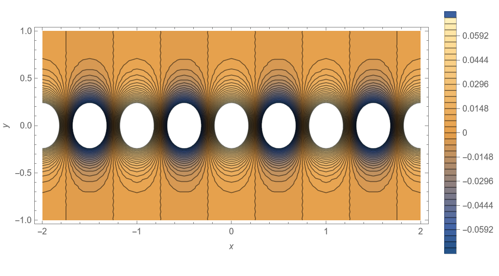 | 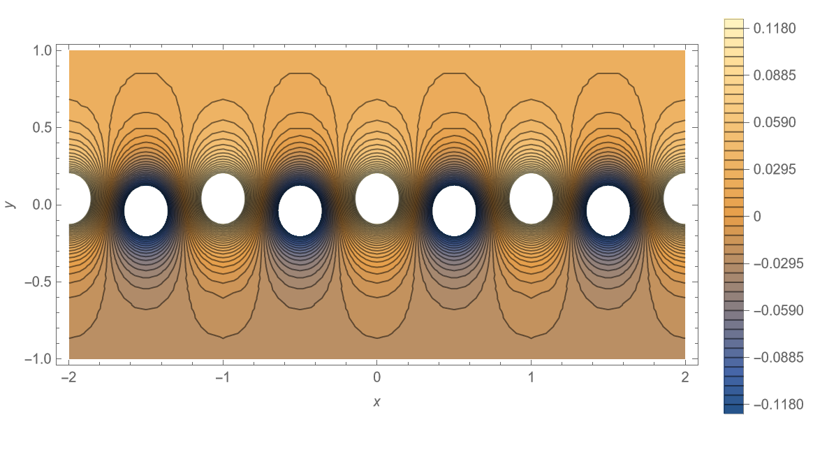 
 :----------------------------------------------------------: | :----------------------------------------------------------: 
(*a*) *b/a* = 0.00                                              |                      (*b*) *b/a* = 0.05
 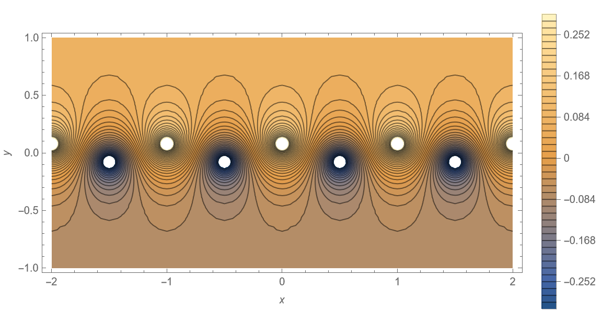 | 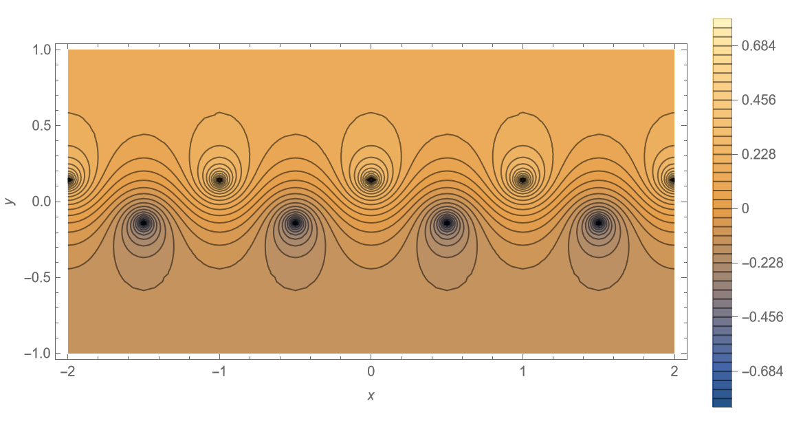 
(*c*) *b/a* = 0.15                                               |                     (*d*) *b/a* = 0.2806
 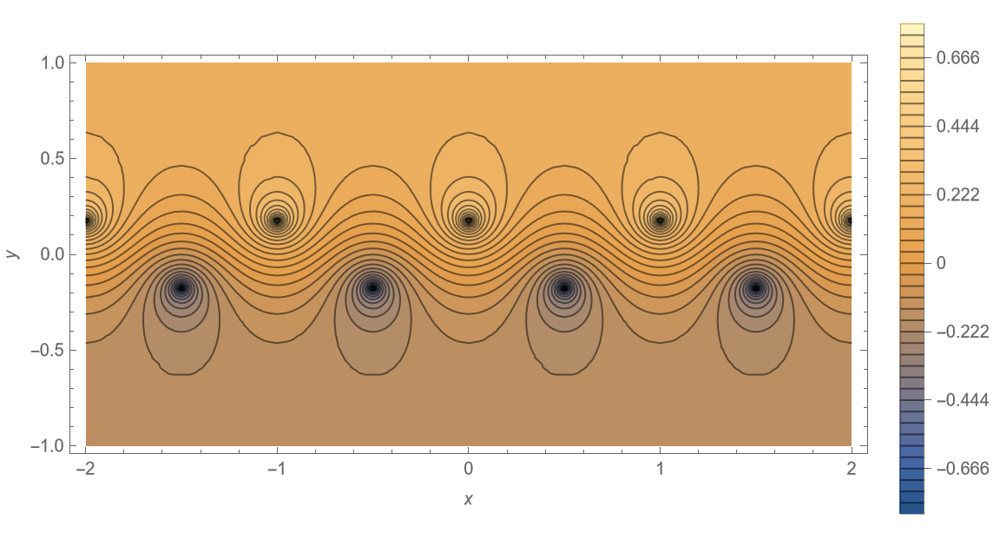 | 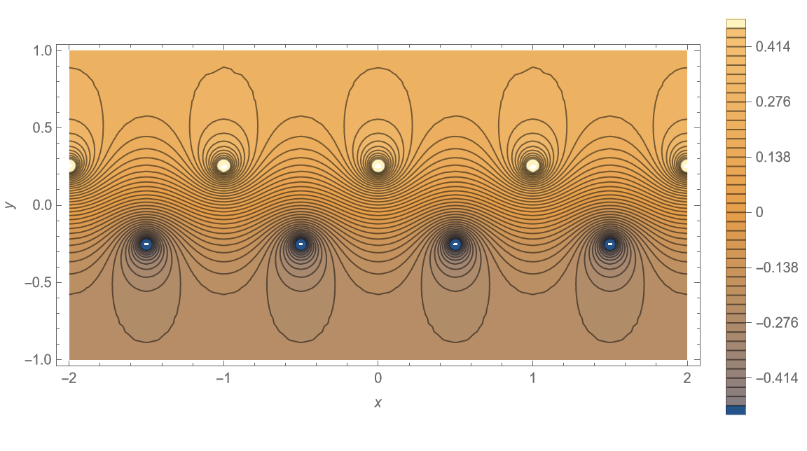 
(*e*) *b/a* = 0.35                                               |                      (*f*) *b/a* = 0.50
 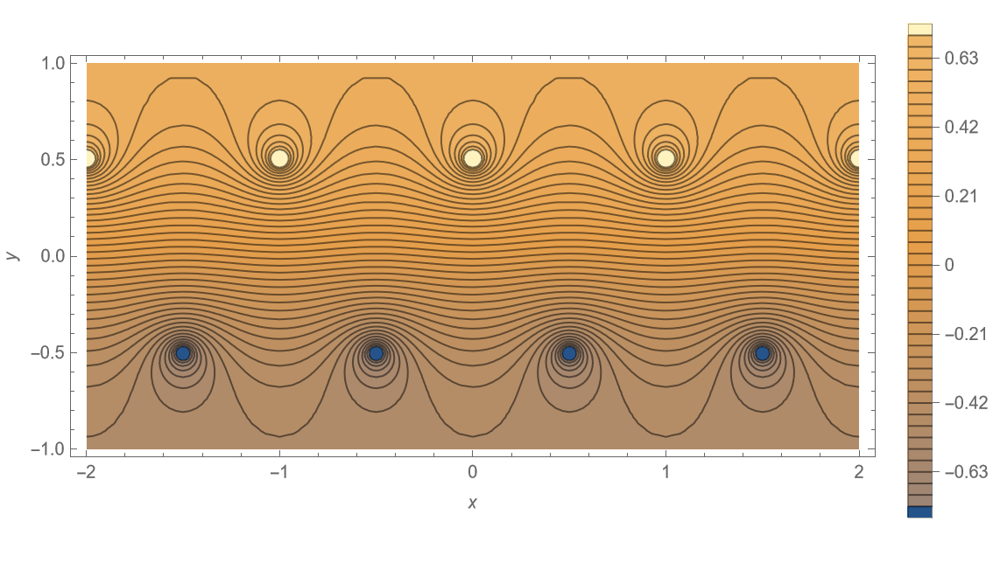 | 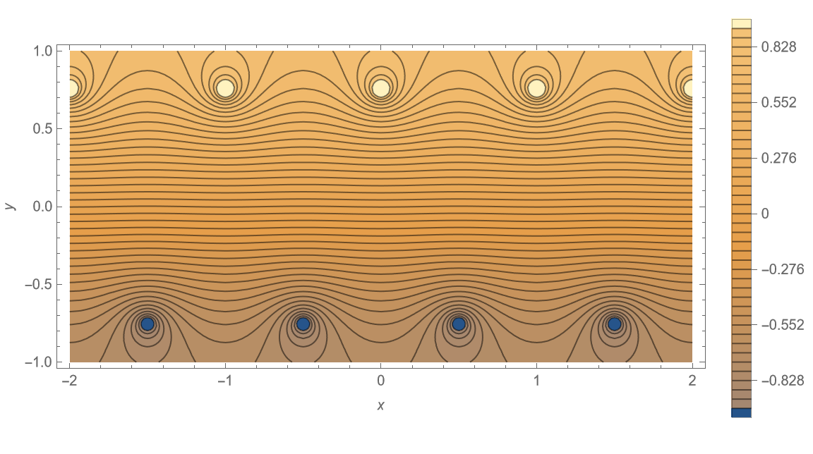 
(*g*) *b/a* = 1.00                                               |                      (*h*) *b/a* = 1.50

<center><font size = 2.5> 图 3  不同 <i>b/a</i> 情形下点涡系诱导的流线簇示意图 </font></center>

<br/>

<font color = blue>**由一个看似基本的点涡系稳定性问题，便获得了卡门涡街优美的数学模型**</font>，是不是很奇妙呢？

后来，在卡门基础上，进一步研究发现，圆柱绕流卡门涡街（如图 [4](#fig4) 所示）的形成，**其来流必须满足一定条件**。

<span id = "fig4"></span>

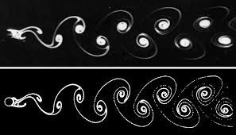

<center><font size = 2.5> 图 4  圆柱绕流形成卡门涡街示意图 </font></center>

由 <font color = red>**量纲分析**</font> （相应推导从略）可知，主导涡街形态的两个无量纲数为 **斯特劳哈尔数** $\operatorname{St}$ **(Strouhal number)** 和 **雷诺数** $\operatorname{Re}$ **(Reynolds number)**，其定义分别如下：
$$
\operatorname{St} = \frac{f L}{U}
\tag{16}
\label{eq16}
$$
其中 $f$ 为涡脱频率，$L$ 为特征长度，$U$ 为来流速度。$\operatorname{St}$ 的物理意义是非定常运动惯性力与惯性力之比，是表征流动非定常性的相似准则，也是是非定常空气动力实验中要模拟的相似准则。
$$
\operatorname{Re}_{L} = \frac{U L}{\nu}
\tag{17}
\label{eq17}
$$
其中，$\nu$ 为运动粘性系数。$\operatorname{Re}_{L}$ 的物理意义是定常运惯性力与粘性力之比，是流体力学中**最基本、最重要**的无量纲数。

关于卡门涡街中扰流圆柱涡的脱落频率 $f$，**泰勒（*F. Taylor*）**和 **瑞利（*L. Rayleigh*）**给出了下列经验公式[<sup>[3]</sup>](#refer-anchor-3)
$$
f = 0.198\frac{U}{d}(1 - \frac{19.7}{\operatorname{Re}_{d}})
\tag{18}
\label{eq18}
$$
该式适用于 $250<\operatorname{Re}_{d}= \frac{U d}{\nu}<2 \times 10^{5}$ 。其中 $d$ 为圆柱直径。由此看出，扰流圆柱卡门涡街中涡脱落频率 $f$ 与流速 $U$ 成正比，即流速越大，涡脱落的越快；而与圆柱直径 $d$ 成反比，即圆柱直径越大，涡脱落的越慢。

通过上述经验式我们还可以定量分析一些现象：比如在风吹电线嗡鸣发声的现象中，假设已知风速和电线的直径，那么就可以获得风嗡鸣的频率。反之，我们测得了声音频率就可以获得风速！[<sup>[4]</sup>](#refer-anchor-4)

神奇的卡门涡街，伟大的物理直觉，无穷的科学灵感！

------

以上就是本文全部内容，如有疑问，敬请大家批评指正！

相应文章也将发布在我的B站空间、知乎专栏上。后续我会不定期更新本博客与专栏，欢迎大家关注！ 

------


## 参考资料

<div id="refer-anchor-1"></div>

- [1] 吴望一. 流体力学.下册[M]. 北京大学出版社, 1983.

<div id="refer-anchor-2"></div>

- [2] 朱克勤，彭杰. 高等流体力学[M]. 科学出版社, 2017.

<div id="refer-anchor-3"></div>

- [3] Wikipedia contributors. "[Kármán vortex street](https://en.wikipedia.org/wiki/K%C3%A1rm%C3%A1n_vortex_street)." *Wikipedia, The Free Encyclopedia*.

<div id="refer-anchor-4"></div>

- [4] [流川疯](https://www.zhihu.com/people/sheng-ren-mo-shi-24), [「流体那些事儿之卡门涡街」](https://zhuanlan.zhihu.com/p/129273764), 知乎 

## 附录

本文采用的 ***Mathematica*** 代码如下：

```mathematica
a = 1;
b = 0.2806;
Gamma0 = 1;
Phi = (-(Gamma0/(4 * Pi)))*
Log[(Cosh[(2*Pi)/a*(y - b/2)] - Cos[(2*Pi*x)/a])/(
Cosh[(2*Pi)/a*(y + b/2)] - Cos[(2*Pi)/a*(x - a/2)])];
graph1 = ContourPlot[Phi, {x, -2, 2}, {y, -1, 1}, 
PlotTheme -> "Detailed", AspectRatio -> Automatic, Contours -> 42, 
FrameLabel -> {x, y}, PerformanceGoal -> "Quality", ImageSize -> 500]
Export["Karman_Vortex_Street_Sample.pdf", graph1]
```

------



<font size = 2.5>^_^ This is the END of the article. Thank you for reading! </font>

<font size = 2.5>If you think this article is helpful to you, do not hesitate to leave your comments!</font>

<font size = 2.5>Finished by <i><b>pkufzh (Small Shrimp)</b></i> on <i><b>2022/02/14</b></i> .</font>



<center><i> Who am I? A happy shrimp from Peking University! </i></center>
