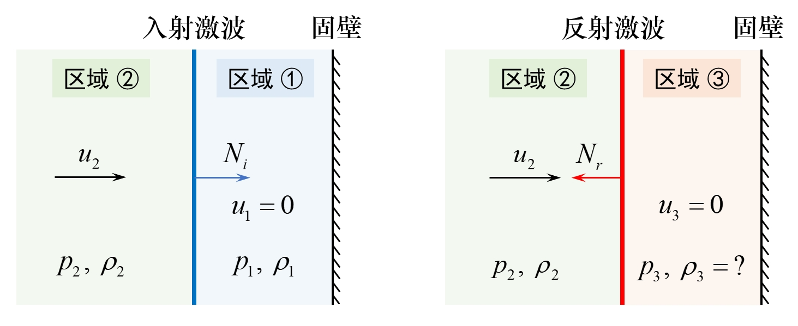

# 有趣的流体小知识（四）——激波在固壁上的反射问题

很久没有更新流体专栏啦，这份笔记分享的是一个关于**激波**的气体动力学问题，虽小但有趣。关于激波的有趣知识，可以关注萌萌战队的精彩科普，每日激波（1/1）走起（手动狗头）。欢迎各位**点赞、收藏、转发！**

## 一、典型的激波固壁反射问题

在战场上，一枚手雷在士兵的掩体（墙面）边爆炸，此时士兵若不采取卧倒规避，则非常容易被爆炸引起在掩体反射的冲击波所伤害，而且通常反射的冲击波更强。低空作超声速飞行的战机，在地面引起的声爆震耳欲聋，房屋窗户难逃一劫。另外，在高速风洞、激波管实验中，激波的固壁反射也是需要格外注意的安全问题……

我们想要回答：**为什么激波在固壁反射后，强度会急剧增加？**

如图 [1](#fig1) ，考虑一道入射激波在固壁上反射，现求反射前后壁面上压强的变化（$p_{1} \rightarrow p_{3}$），已知入射激波前（反射激波后）速度 $u_{2}$，压强 $p_{2}$，密度 $\rho_{2}$；入射与反射激波运动速度分别为 $N_{i}, \; N_{r}$；入射激波后（反射激波前）区域气体速度为零，即 $u_{1} = u_{3} = 0$。

 图 1  激波在固壁上的反射问题示意图 

 

## 二、详细推导过程

### 1、Rankine-Hugoniot (R-H) 条件

首先写出激波（强间断）处的 Rankine-Hugoniot (R-H) 条件
$$
\begin{align}
\rho_{-} v_{-} & = \rho_{+} v_{+} \label{eq001} \tag{1}\\
\rho_{-} v_{-}^{2} + p_{-} & = \rho_{+} v_{+}^{2} + p_{+} \label{eq002} \tag{2}\\
(\rho_{-} e_{-} + \frac{1}{2} \rho_{-} v_{-}^{2} + p_{-}) v_{-} & = (\rho_{+} e_{+} + \frac{1}{2} \rho_{+} v_{+}^{2} + p_{+}) v_{+} \label{eq003} \tag{3}\\
\end{align}
$$
其中，下标带 "-" 量和带 "+" 量分别代表通过激波前后的物理量，$\rho$ 为密度，$p$ 为压强，$e$ 为比内能，$v$ 代表气流参考激波的相对速度（即以激波为参考系观察到的气流速度），满足以下关系式

$$
\begin{align}
v_{-} = u_{-} - U \label{eq004} \tag{4}\\
v_{+} = u_{+} - U \label{eq005} \tag{5}
\end{align}
$$
这里 $u_{-}$ 与 $u_{+}$ 分别代表激波前后气流速度的绝对值，$U$ 为激波行进速度.

下面寻找通过激波前后的物理量变化规律。

### 2、推导 Prandtl 关系式

由式 (3) / (1) 可得
$$
H = e_{-} + \frac{p_{-}}{\rho_{-}} + \frac{1}{2} v_{-}^{2} = e_{+} + \frac{p_{+}}{\rho_{+}} + \frac{1}{2} v_{+}^{2} \label{eq006} \tag{6}
$$
即通过激波前后比总焓 $H = h + v^{2} / 2$ 不变，其中 $h$ 为比焓。由于以下关系式（理想可压缩流的 Bernoulli 积分）
$$
H = h + \frac{1}{2} v^{2} = \frac{a^{2}}{\gamma - 1} + \frac{1}{2} v^{2} = \frac{1}{2} \frac{\gamma + 1}{\gamma - 1} a_{\ast}^{2} \label{eq007} \tag{7}
$$
其中，$a$ 为声速，$a_{\ast}$ 为临界声速。则激波两侧的临界声速 $a_{\ast}$ 也相同，且有
$$
\begin{align}
\rho_{+} a_{\ast}^{2} & = \frac{\gamma - 1}{\gamma + 1} \left( 2 \rho_{+} e_{+} + 2 p_{+} + \rho_{+} v_{+}^{2} \right) \\
& = \frac{\gamma - 1}{\gamma + 1} \left( \frac{2 p_{+}}{\gamma - 1} + 2 p_{+} + \rho_{+} v_{+}^{2} \right) \\
& = \frac{\gamma - 1}{\gamma + 1} \left( \rho_{+} v_{+}^{2} + p_{+}\right) + p_{+}
\end{align} \label{eq008} \tag{8}
$$

同理，有
$$
\rho_{-} a_{\ast}^{2} = \frac{\gamma - 1}{\gamma + 1} \left( \rho_{-} v_{-}^{2} + p_{-}\right) + p_{-} \label{eq009} \tag{9}
$$
由式 (8) 减 (9)，并结合式 (2)，可得
$$
a_{\ast}^{2} = \frac{p_{+} - p_{-}}{\rho_{+} - \rho_{-}} \label{eq010} \tag{10}
$$
又由 R-H 条件中的式 (1) (2) 可得
$$
\begin{align}
\rho_{-} v_{-}^{2} & = \rho_{+} v_{-} v_{+} \label{eq011} \tag{11} \\
\rho_{+} v_{+}^{2} & = \rho_{-} v_{-} v_{+} \label{eq012} \tag{12} \\
p_{+} - p_{-} & = \rho_{-} v_{-}^{2} - \rho_{+} v_{+}^{2} \label{eq013} \tag{13}
\end{align}
$$
将式 (11) (12) 代入式 (13)，可得
$$
v_{-} v_{+} = \frac{p_{+} - p_{-}}{\rho_{+} - \rho_{-}} \label{eq014} \tag{14}
$$
联立式 (10) (14) 易知
$$
v_{-} v_{+} = a_{\ast}^{2} \label{eq015} \tag{15}
$$
若定义速度系数 $\lambda = v / a_{\ast}$，则激波前后的速度系数满足关系式
$$
\lambda_{-} \lambda_{+} = 1 \label{eq016} \tag{16}
$$
由上式可知，当 $\lambda_{-} > 1, \; \lambda_{+} < 1$，等价于 $Ma_{-} > 1, \; Ma_{+} < 1$，说明跨越激波时，$p, \rho, s$ 增加，速度 $v$ 减小。波前气流相对激波速度为超声速，波后为亚声速.

式 (15) 即为 Prandtl 关系式。

### 3、推导激波前后的压强比与波前马赫数的关系式

下面推导激波前后的压强比 $p_{+} / p_{-}$ 与波前马赫数 $Ma_{-}$ 的关系式。

这里我们从 $\rho_{+} / \rho_{-}$ 间接推导 $p_{+} / p_{-}$，当然还有其他方法，具体可参考教材。

用 $h$ 除式 (5)，可得
$$
\frac{H}{h} = \frac{\frac{1}{2} \frac{\gamma + 1}{\gamma - 1} a_{\ast}^{2}}{\frac{1}{\gamma - 1} a^{2}} = \frac{\gamma + 1}{2} \left(\frac{a_{\ast}}{a}\right)^{2} \label{eq017} \tag{17}
$$
并结合等熵关系式可得
$$
\frac{H}{h} = \frac{T_{0}}{T} = 1 + \frac{v^{2}}{2 h} = 1 + \frac{\gamma - 1}{2} Ma^{2} \label{eq018} \tag{18}
$$
联立式 (17) (18) 可得
$$
\frac{a_{\ast}}{a} = \left[\frac{2}{\gamma + 1} \left(1 + \frac{\gamma - 1}{2} Ma^{2}\right)\right] = \left[\frac{2 + (\gamma - 1) Ma^{2}}{\gamma + 1}\right]^{\frac{1}{2}} \label{eq019} \tag{19}
$$
由速度系数 $\lambda$ 的定义可得
$$
\lambda = \frac{v}{a_{\ast}} = \frac{v}{a} \frac{a}{a_{\ast}} = Ma \left[\frac{2 + (\gamma - 1) Ma^{2}}{\gamma + 1}\right]^{- \frac{1}{2}} = \left[\frac{(\gamma + 1) Ma^2}{2 + (\gamma - 1) Ma^{2}}\right]^{\frac{1}{2}} \label{eq020} \tag{20}
$$
故应用式 (1) (15) (20)，可得激波前后的密度之比与 $Ma_{-}$ 的关系为
$$
\frac{\rho_{+}}{\rho_{-}} = \frac{v_{-}}{v_{+}} = \frac{v_{-}^{2}}{v_{-}v^{+}} = \frac{v_{-}^{2}}{a_{\ast}^{2}} = \lambda_{-}^{2} = \frac{(\gamma + 1) Ma_{-}^{2}}{2 + (\gamma - 1) Ma_{-}^{2}} \label{eq021} \tag{21}
$$
再根据由 R-H 条件的 (1) (2) 式推导得到的式 (13)
$$
\begin{align}
p_{+} - p_{-} & = \rho_{-} v_{-}^{2} - \rho_{+} v_{+}^{2} \\
& = \rho_{-} v_{-} \left(v_{-} - v_{+}\right) \\
& = \rho_{-} v_{-}^{2} \left(1 - \frac{v_{+}}{v_{-}}\right)
\end{align} \label{eq022} \tag{22}
$$
用 $p_{-}$ 除上式 (22) 可得
$$
\begin{align}
\frac{p_{+} - p_{-}}{p_{-}} & = \frac{\gamma \rho_{-} v_{-}^2}{\gamma p_{-}} \left(1 - \frac{v_{+}}{v_{-}}\right) \\
& = \frac{\gamma v_{-}^{2}}{a_{-}^{2}} \left(1 - \frac{v_{+}}{v_{-}}\right) \\
& = \gamma Ma_{-}^{2} \left(1 - \frac{v_{+}}{v_{-}}\right)
\end{align} \label{eq023} \tag{23}
$$
将式 (21) 代入式 (23) ，整理可得
$$
\frac{p_{+}}{p_{-}} = 1 + \frac{2 \gamma}{\gamma + 1} \left(Ma_{-}^{2} - 1\right) \label{eq024} \tag{24}
$$

### 4、推导区域 ② 气流速度满足的方程

下面推导入射激波波前与反射激波波后气流速度 $u_{2}$ 满足的关系（对应相同区域②）。

联立总焓关系式 (5) 与 Prandtl 关系式 (15) 可得
$$
v_{-} v_{+} = a_{\ast}^{2} = \frac{\gamma - 1}{\gamma + 1} v_{-}^{2} + \frac{2}{\gamma + 1} a_{-}^{2} = \frac{\gamma - 1}{\gamma + 1} v_{+}^{2} + \frac{2}{\gamma + 1} a_{+}^{2} \label{eq025} \tag{25}
$$
引入简单关系式
$$
\mu^{2} = \frac{\gamma - 1}{\gamma + 1} \label{eq026} \tag{26}
$$

则式 (25) 可写为
$$
v_{-} v_{+} = a_{\ast}^{2} = \mu^{2} v_{-}^{2} + (1 - \mu^{2}) a_{-}^{2} = \mu^{2} v_{+}^{2} + (1 - \mu^{2}) a_{+}^{2} \label{eq027} \tag{27}
$$
可变形为以下方程
$$
(1 - \mu^{2}) v_{-}^{2} + (v_{+} - v_{-}) v_{-} - (1 - \mu^{2}) a_{-}^{2} = 0 \label{eq028} \tag{28}
$$
注意到，在上式中应用关系式 (4) (5) 可得
$$
(1 - \mu^{2}) \left(u_{-} - U\right)^{2} + (u_{+} - u_{-}) (u_{-} - U) - (1 - \mu^{2}) a_{-}^{2} = 0 \label{eq029} \tag{29}
$$
两边同除 $(1 - \mu^{2}) \neq 0$ 可得
$$
\left(u_{-} - U\right)^{2} + \frac{(u_{+} - u_{-}) (u_{-} - U)}{(1 - \mu^{2}) } - a_{-}^{2} = 0 \label{eq030} \tag{30}
$$
下面回到原激波反射问题。 

*a*) 对于入射激波情形，

 "-" ：激波前区域② ：已知 $p_{2}, \; \rho_{2}, \; u_{2}, \; a_{2} = \sqrt{\gamma p_{2} / \rho_{2}}$；

 "+" ：激波后区域① ：已知 $u_{1} = 0$，未知 $p_{1}, \; \rho_{1}, \; a_{1}$；

激波速度（以向右为正方向）：$U = N_{i} > 0$。

将激波前后参数代入式 (29) 可得方程
$$
\left(u_{2} - N_{i}\right)^{2} - \frac{u_{2}}{1 - \mu^{2}} \left(u_{2} - N_{i}\right) - a_{2}^{2} = 0 \label{eq031} \tag{31}
$$

*b*) 对于反射激波情形，

 "-" ：激波前区域② ：已知 $p_{2}, \; \rho_{2}, \; u_{2}, \; a_{2} = \sqrt{\gamma p_{2} / \rho_{2}}$；

 "+" ：激波后区域③ ：已知 $u_{3} = 0$，未知 $p_{3}, \; \rho_{3}, \; a_{3}$；

激波速度（以向右为正方向）：$U = N_{r} < 0$。

类似地可得
$$
\left(u_{2} - N_{r}\right)^{2} - \frac{u_{2}}{1 - \mu^{2}} \left(u_{2} - N_{r}\right) - a_{2}^{2} = 0 \label{eq032} \tag{32}
$$
由式 (31) (32) 可得：$(u_{2} - N_{i}), \; (u_{2} - N_{r})$ 为同一个二次方程的两个根。

不妨设 $Ma_{i} = (u_{2} - N_{i}) / a_{2}, \; Ma_{r} = (u_{2} - N_{r}) / a_{2}$ 分别代表入射、反射激波前区域马赫数，则 $Ma_{i}, \; Ma_{r}$ 为以下二次方程的两个不同实根
$$
Ma^{2} - \frac{u_{2}}{(1 - \mu^{2}) a_{2}} \cdot Ma - 1 = 0 \label{eq033} \tag{33}
$$
则两根满足
$$
Ma_{i} \cdot Ma_{r} = -1 \label{eq034} \tag{34}
$$
### 5、最终解：激波反射压强比

应用通过激波前后的压强比与波前马赫数之间的关系式 (24) 可得
$$
\begin{align}
\frac{p_{1}}{p_{2}} & = 1 + \frac{2 \gamma}{\gamma + 1} \left(Ma_{i}^{2} - 1\right) = (1 + \mu^{2}) Ma_{i}^{2} - \mu^{2} \label{eq035} \tag{35}\\
\frac{p_{3}}{p_{2}} & = 1 + \frac{2 \gamma}{\gamma + 1} \left(Ma_{r}^{2} - 1\right) = (1 + \mu^{2}) Ma_{r}^{2} - \mu^{2} \label{eq036} \tag{36}
\end{align}
$$
根据式 (32)，联立上面两式 (33) (34) 可得
$$
\frac{p_{3}}{p_{2}} = \frac{(1 + 2 \mu^{2}) - \mu^{2} \frac{p_{1}}{p_{2}}}{\frac{p_{1}}{p_{2}} + \mu^{2}} = \frac{(1 + 2 \mu^{2} \frac{p_{2}}{p_{1}} - \mu^{2}}{\mu^{2} \frac{p_{2}}{p_{1}} + 1} \label{eq037} \tag{37}
$$
则有关系式
$$
\frac{p_{3} - p_{2}}{p_{2} - p_{1}} = \frac{\frac{p_{3}}{p_{2}} - 1}{1 - \frac{p_{1}}{p_{2}}} = \frac{\frac{(1 + 2 \mu^{2}) - \mu^{2} \frac{p_{1}}{p_{2}})}{\frac{p_{1}}{p_{2}} + \mu^{2}} - 1}{1 - \frac{p_{1}}{p_{2}}} = \frac{1 + \mu^{2}}{\frac{p_{1}}{p_{2}} + \mu^{2}} = \frac{2 \gamma}{(\gamma + 1) \frac{p_{1}}{p_{2}} + (\gamma - 1)} \label{eq038} \tag{38}
$$
或
$$
\frac{p_{3} - p_{1}}{p_{2} - p_{1}} = \frac{(p_{3} - p_{2}) + (p_{2} - p_{1})}{p_{2} - p_{1}} = 1 + \frac{p_{3} - p_{2}}{p_{2} - p_{1}} = 1 + \frac{1 + \mu^{2}}{\frac{p_{1}}{p_{2}} + \mu^{2}} = 1 + \frac{2 \gamma}{(\gamma + 1) \frac{p_{1}}{p_{2}} + (\gamma - 1)} \label{eq039} \tag{39}
$$
## 三、极端情况分析与解释

*a*) 若入射激波很强，即有 $p_{2} / p_{1} \gg 1$，则有近似关系式
$$
\frac{p_{3}-p_{1}}{p_{2}-p_{1}} \sim 1+\frac{2 \gamma}{\gamma-1}=2+\frac{1}{\mu^{2}}
=\left\{\begin{array}{ll}
8, & \text { for } \gamma = 1.4 \\
13, & \text { for } \gamma = 1.2 \\
23, & \text { for } \gamma = 1.1
\end{array}\right. \label{eq040} \tag{40}
$$
可见激波经过壁面反射后，静止区域③的压强相比初始状态①有巨大提升，**压强可达到原始的 8 倍**！**这就解释了为什么强激波在固壁上的反射非常危险。**

*b*) 若入射激波很弱，即有 $p_{2} / p_{1} \sim 1$，则有近似关系式
$$
\frac{p_{3} - p_{1}}{p_{2} - p_{1}} \sim 2 \label{eq041} \tag{41}
$$
结果与声波反射情况结果一致。由于 $p_{2} \approx p_{1}$，即有 $p_{3} \approx p_{1}$，此时反射前后压强几乎不变。

----

以上就是本文全部内容，如有疑问，敬请批评指正，欢迎关注与留言！

------



^_^ This is the END of the article. Thank you for reading! 

If you think this article is helpful to you, do not hesitate to leave your comments!

Finished by <i><b>pkufzh (Small Shrimp)</b></i> on <i><b>2024/01/08</b></i> .



<i> Who am I? A happy shrimp from Peking University! </i>

